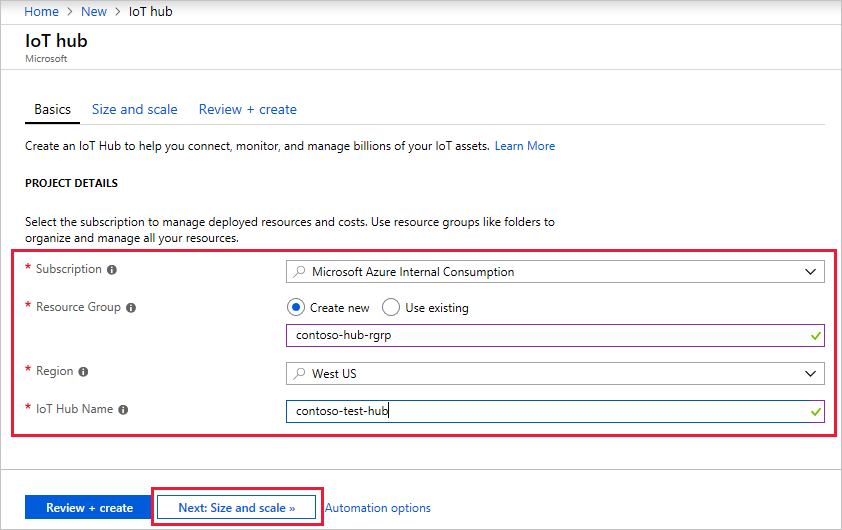
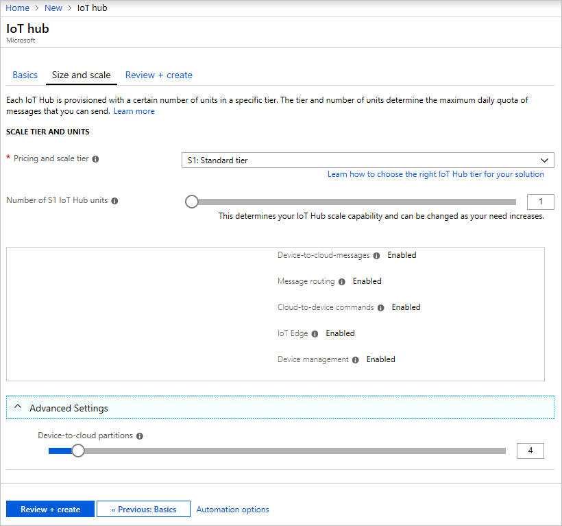
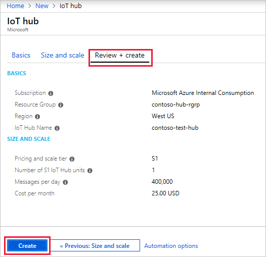
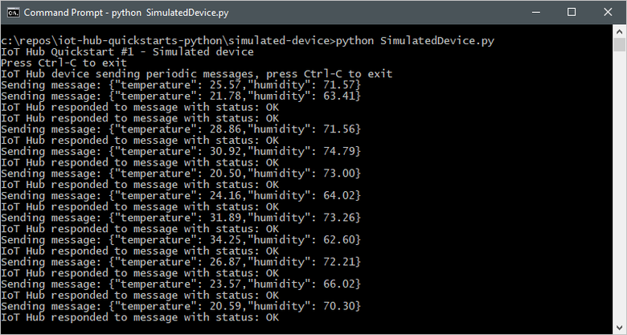
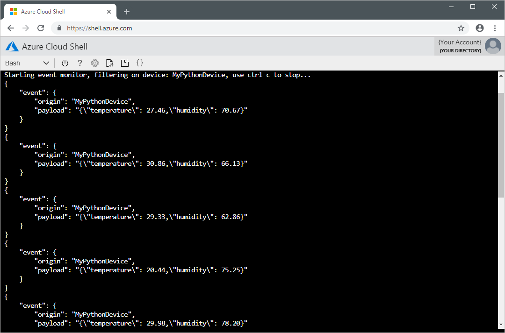

# Create Iot Hub and Devices In Azure

## Steps

### Sign up for Free Microsoft Azure Account

To create and use Azure services, you will eventually need an account. Remember, the account is free - you will not be charged for any services until you convert the account to a pay-as-you-go account.

!!! info "Note"
    You will need a valid credit card to create the account. This is used for age and identity validation only. Your card will not be charged until you decide to upgrade the free/trial account to a full subscription.

1. In a web browser, navigate to [azure.microsoft.com](https://azure.microsoft.com/), and click **Free Account**.

2. On the **Create your Azure free account today** page, click **Start free >** button.

3. Scroll down through the page - it lists the products you can access for free, as well as the free products available for the first year.

4. Click the **Start free >** button. You'll be prompted to sign in with your Microsoft account. Sign in with your Microsoft credentials or create a new free Microsoft account.

5. On the **About you** page, select your correct country or region, and then enter your first and last names, along with your email address and phone number. Depending on your country, you may see additional fields, such as a VAT number. Click **Next** to continue.

6. On the **Identity verification by phone** screen, select your country code, and type the number of a telephone to which you have immediate access.

7. You have the option of text or callback to obtain a verification code. Click the relevant button, type the code in the **Verification code** box, and click **Verify code**.

8. If the verification code is correct, you will now be asked to enter details of a valid credit card. Enter the card number, the expiration date, the CVV number, your name, and address, and click **Next**.

9. Finally, check the box to accept the subscription agreement, privacy statement, and communications policy. The second checkbox is optional. Now click **Sign up**.

!!! info "Reference"
    For reference, please visit [Microsoft Documentation - Create an Azure account](https://docs.microsoft.com/en-us/learn/modules/create-an-azure-account/5-exercise-create-an-azure-account)

### Install Azure Command-Line Interface (CLI)

The Azure command-line interface (CLI) is Microsoft's cross-platform command-line experience for managing Azure resources. The Azure CLI is easy to learn and the perfect tool for building custom automation that works with Azure resources.

| <center><br/>Windows 10</center> | <center><br/>Ubuntu 16.04+</center> | <center><br/>macOS</center> | <center><br/>Azure Cloud Shell</center> |
|---|---|---|---|
| [Download the MSI installer](https://aka.ms/installazurecliwindows) | [Ubuntu install instructions](./install-azure-cli-apt.md) | [macOS install instructions](./install-azure-cli-macos.md) | [Run in your browser on Azure Cloud Shell](https://shell.azure.com) |

[See all of the supported installation platforms.](https://docs.microsoft.com/en-us/cli/azure/install-azure-cli?view=azure-cli-latest)

!!! info "Reference"
    For more references, please visit [Microsoft Documentations - Overview of Azure CLI](https://docs.microsoft.com/en-us/cli/azure/?view=azure-cli-latest)


### Create IoT Hub
This section describes how to create an IoT hub using the [Azure portal](https://portal.azure.com).

1. Log in to the [Azure portal](https://portal.azure.com). 

2. Choose +**Create a resource**, then *Search the Marketplace* for the **IoT Hub**.

3. Select **IoT Hub** and click the **Create** button. You see the first screen for creating an IoT hub.
  

4. Fill in the fields.

    - **Subscription**: Select the subscription to use for your IoT hub.
    - **Resource Group**: You can create a new resource group or use an existing one. To create a new one, click **Create new** and fill in the name you want to use. To use an existing resource group, click **Use existing** and select the resource group from the dropdown list. For more information, see [Manage Azure Resource Manager resource groups](https://docs.microsoft.com/en-us/azure/azure-resource-manager/manage-resource-groups-portal).
    - **Region**: This is the region in which you want your hub to be located. Select the location closest to you from the dropdown list.
    - **IoT Hub Name**: Put in the name for your IoT Hub. This name must be globally unique. If the name you enter is available, a green check mark appears.

    !!! warning "Important!!"
        Because the IoT hub will be publicly discoverable as a DNS endpoint, be sure to avoid entering any sensitive or personally identifiable information when you name it.

5. Click **Next: Size and scale** to continue creating your IoT hub. On this screen, you can take the defaults and just click **Review + create** at the bottom. 
    

    - **Pricing and scale tier**: You can choose from several tiers depending on how many features you want and how many messages you send through your solution per day. The free tier is intended for testing and evaluation. It allows 500 devices to be connected to the IoT hub and up to 8,000 messages per day. Each Azure subscription can create one IoT Hub in the free tier. 

    - **IoT Hub units**: The number of messages allowed per unit per day depends on your hub's pricing tier. For example, if you want the IoT hub to support ingress of 700,000 messages, you choose two S1 tier units. For details about the other tier options, see [Choosing the right IoT Hub tier](https://docs.microsoft.com/en-us/azure/iot-hub/iot-hub-scaling).

    - **Advanced / Device-to-cloud partitions**: This property relates the device-to-cloud messages to the number of simultaneous readers of the messages. Most IoT hubs only need four partitions. 

6. Click **Review + create** to review your choices. You see something similar to this screen.

    

7. Click **Create** to create your new IoT hub. Creating the hub takes a few minutes.

!!! info "Reference"
    For more references, please visit [Microsoft Documentations - Create an IoT hub using the Azure portal](https://docs.microsoft.com/en-us/azure/iot-hub/iot-hub-create-through-portal).

### Register Iot Devices
A device must be registered with your IoT hub before it can connect. In this quickstart, you can use **local terminal** or **Azure Cloud Shell** to register a simulated device.

1. Login to your Azure Account with command below.
    
    ```
    az login
    ```

2. Run the following command to create the device identity.

    ```
    az iot hub device-identity create --hub-name <YourIoTHubName> --device-id <NameOfYourDevice>
    ```

    **YourIoTHubName**: Replace this placeholder below with the name you choose for your IoT hub.

    **NameOfYourDevice**: The name of the device you're registering. You can choose any name for your device. In following workshop, you will need to use the same device name throughout this article. You will also need to update the device name in the sample applications before you run them.

3. Run the following commands in local terminal or Azure Cloud Shell to get the _device connection string_ for the device you just registered:

    ```
    az iot hub device-identity show-connection-string --hub-name <YourIoTHubName> --device-id <NameOfYourDevice> --output table
    ```

    **YourIoTHubName**: Replace this placeholder below with the name you choose for your IoT hub.

    !!! info "Note"
        Make a note of the device connection string, which looks like `HostName=<YourIoTHubName>.azure-devices.net;DeviceId=<NameOfYourDevice>;SharedAccessKey={YourSharedAccessKey}`. You use this value later in the quickstart.
   

4. You also need a _service connection string_ to enable the back-end application to connect to your IoT hub and retrieve the messages. The following command retrieves the service connection string for your IoT hub:

    ```
    az iot hub show-connection-string --name YourIoTHubName --policy-name service --output table
    ```

    **YourIoTHubName**: Replace this placeholder below with the name you choose for your IoT hub.

    !!! info "Note"
        Make a note of the service connection string, which looks like `HostName=<YourIoTHubName>.azure-devices.net;SharedAccessKeyName=service;SharedAccessKey={YourSharedAccessKey}`. You use this value later in the quickstart. 
   
!!! warning "Important!!"
    The service connection string is different from the device connection string.

### Send simulated telemetry
The simulated device application connects to a device-specific endpoint on your IoT hub and sends simulated temperature and humidity telemetry.

In this workshop, we will be using **Python** as main language.

1. Check if Python is installed.
    
    You can verify the current version of Python on your development machine using one of the following commands:

    **Python2**

    ```
    python --version
    ```

    **Python3**

    ```
    python3 --version
    ```

    You can download Python from [Python.org](https://www.python.org/downloads/).

2. Run the following command to add the Microsoft Azure IoT Extension for Azure CLI to your Cloud Shell instance. The IOT Extension adds IoT Hub, IoT Edge, and IoT Device Provisioning Service (DPS) specific commands to Azure CLI.

    ```
    az extension add --name azure-cli-iot-ext
    ```

    Download the sample Python project from [https://github.com/Azure-Samples/azure-iot-samples-python/archive/master.zip](https://github.com/Azure-Samples/azure-iot-samples-python/archive/master.zip) and extract the ZIP archive.

3. Under Linux or MacOS system, make sure Boost Library is installed. Skip this step if Windows system is used.

    **Linux**

    ```
    apt-get install libboost-python-dev
    ```

    **MacOS**

    ```
    brew install boost
    ```

    Python2:

    ```
    brew install boost-python
    ```

    Python3:

    ```
    brew install boost-python3
    ```

4. Navigate to the root folder of the downloaded sample Python project. Then navigate to the **iot-hub\Quickstarts\simulated-device** folder.

5. Open the **SimulatedDevice.py** file in a text editor of your choice.

    Replace the value of the `CONNECTION_STRING` variable with the device connection string you made a note of previously. Then save your changes to **SimulatedDevice.py** file.

    !!! info "Note"
        Make a note of the device connection string, which looks like `HostName=<YourIoTHubName>.azure-devices.net;DeviceId=<NameOfYourDevice>;SharedAccessKey={YourSharedAccessKey}`.

6. In the local terminal window, run the following commands to install the required libraries for the simulated device application:

    Python2:

    ``` python
    pip install azure-iothub-device-client
    ```

    Python3:

    ``` python
    pip3 install azure-iothub-device-client
    ```   

7. In the local terminal window, run the following commands to run the simulated device application:

    Python2:

    ``` python
    python SimulatedDevice.py
    ```

    Python3:

    ``` python
    python3 SimulatedDevice.py
    ```

    The following screenshot shows the output as the simulated device application sends telemetry to your IoT hub:

    
 
    !!! warning "Troubleshoot"
        **To avoid the import iothub_client error**
        
        The current version of the Azure IoT SDK for Python is a wrapper over [our C SDK](https://github.com/azure/azure-iot-sdk-c). It is generated using the [Boost](https://www.boost.org/) library. Because of that, it comes with several significant limitations. See more details [here](https://github.com/Azure/azure-iot-sdk-python#important-installation-notes---dealing-with-importerror-issues)

        1. Check that you have the right version of [Python](https://github.com/Azure/azure-iot-sdk-python#important-installation-notes---dealing-with-importerror-issues). Be aware that only certain versions works fine for this sample. 
        2. Check that you have the right version of C++ runtime  [Microsoft Visual C++ Redistributable for Visual Studio 2019](https://support.microsoft.com/en-us/help/2977003/the-latest-supported-visual-c-downloads). (We recommend the latest).
        3. Verify that you have installed the iothub client: `pip install azure-iothub-device-client`.

### Read telemetry from Cloud
The IoT Hub CLI extension can connect to the service-side **Events** endpoint on your IoT Hub. The extension receives the device-to-cloud messages sent from your simulated device. An IoT Hub back-end application typically runs in the cloud to receive and process device-to-cloud messages.

1. Run the following commands in local terminal or Azure Cloud Shell, replacing `YourIoTHubName` with the name of your IoT hub:

    ```
    az iot hub monitor-events --hub-name YourIoTHubName --device-id <NameOfYourDevice>
    ```

2. The following screenshot shows the output as the extension receives telemetry sent by the simulated device to the hub:

    

## References
For more info, please visit [https://docs.microsoft.com/en-us/azure/iot-hub/](https://docs.microsoft.com/en-us/azure/iot-hub/)
