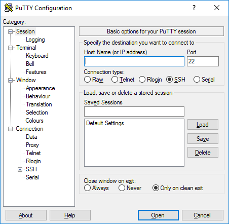
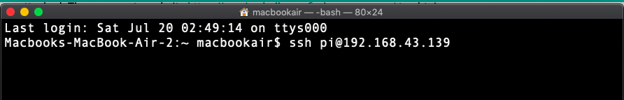

# Getting Started with Raspberry Pi

In this course, we will be using Raspberry Pi in headless mode (a.k.a no keyboard, mouse or monitor attached to Raspberry Pi). We will use our personal computer to remote access to Raspberry Pi instead. The Raspberry Pi in this workshop has prebuild image which has VNC and SSH capability.

## Getting IP address 
First of all, we will need IP address of Raspberry Pi. Power up your Raspberry Pi with NB-IoT Hat attached. Then access to website [https://maxis-challenge.firebaseapp.com/](https://maxis-challenge.firebaseapp.com/) to obtain your Raspberry Pi Information by referring IMEI from NB-IoT HAT. 

## VNC
1. Download VNC Viewer from [here](https://www.realvnc.com/en/connect/download/viewer/). Choose appropriate installer for your PC which will remote access to Raspberry Pi.

2. Open VNC Viewer.
    

3. Enter Raspberry Pi IP Address and Press Enter Button.
    

4. Enter username and password for Raspberry Pi. By default, username is `pi` and password is `raspberry`.
    

5. Viola! Now you can access to Rasberry Pi remotely.

## SSH
- Windows
    1. Download Putty software from [here](https://www.putty.org/).
    2. Open downloaded Putty.exe.
    3. Select SSH and enter your Raspberry Pi IP Address.
    
    4. Press `Open` button to open SSH Terminal.
    5. When `login as` appears, enter `pi`, we are going to login as pi.
    6. By default the password is `raspberry`.

- Mac OS, Linux
    - Run command `ssh pi@<youripaddress>` in local terminal.
    
    - Enter password `raspberry`.