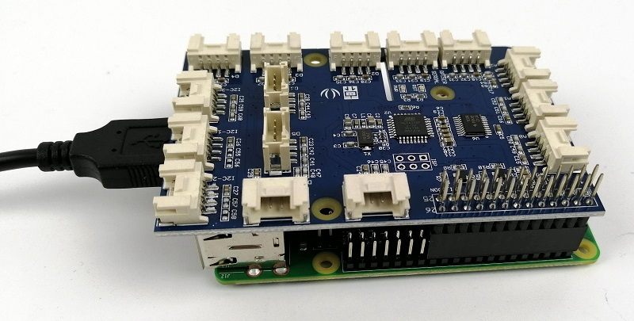
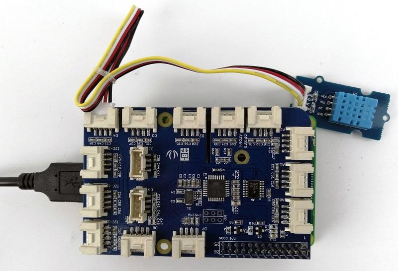

# Grove Pi with Raspberry Pi

This course explains how to use Grove Pi HAT with Rasbperry Pi to interface, control and get data from sensors. 

The GrovePi can be programmed in **Python**, **C**, **C#**, **Go**, and **NodeJS** on the Raspberry Pi. We will be using **Python** as main language for the course.


## Install Grove Pi Python (Important)
```c
$ sudo curl -kL dexterindustries.com/update_grovepi | bash
$ sudo reboot
```

## Firmware Update (Important)
```c
$ cd Dexter/GrovePi/Firmware
$ sudo chmod +x firmware_update.sh
$ sudo bash firmware_update.sh
```

## Getting started with Example DHT Temperature & Humidity Sensor

Sounds familiar? Temperature and humidity are the values that are being sent to Azure Cloud if you are following previous course. 
Right now we can send those values from actual hardware DHT11 Temperature & Humidity Sensor.

### Steps

1. Plug the Grove Pi HAT onto Raspberry Pi.
 
2. Plug the DHT11 Sensor (Blue color) to port D4 on GrovePi.

3. Create a python script called dht.py.
4. Copy the following content into dht.py.
``` python
#!/usr/bin/env python

import grovepi
import math
from time import sleep
# Connect the Grove Temperature & Humidity Sensor Pro to digital port D4
# This example uses the blue colored sensor.
# SIG,NC,VCC,GND
sensor = 4  # The Sensor goes on digital port 4.

# temp_humidity_sensor_type
# Grove Base Kit comes with the blue sensor.
blue = 0    # The Blue colored sensor.
white = 1   # The White colored sensor.

try:
    while True:
        try:
            # This example uses the blue colored sensor. 
            # The first parameter is the port, the second parameter is the type of sensor.
            [temp,humidity] = grovepi.dht(sensor,blue)  
            if math.isnan(temp) == False and math.isnan(humidity) == False:
                print("temp = %.02f C humidity =%.02f%%"%(temp, humidity))
            sleep(1)

        except IOError:
            print ("Error")

except KeyboardInterrupt:
    print ("Pressed Ctrl+C. Exiting now..")
```

5. Run command `sudo python dht.py` to run the program.
6. If the setup is correct, we will see temperature and humidity values are showing up.

    !!! info "Important"
        We have discovered that to make the script to run properly, step [Install Grove Pi Python](#install-grove-pi-python-important) and [Firmware Update](#firmware-update-important) must be completed at least once to install proper GrovePi Library. Install GrovePi Library using `pip install` or `pip3 install` will cause the script not to run properly.

### Alternative

If the script above does not run nicely as expected, you can consider following steps. 

1. Plug the Grove Pi HAT onto Raspberry Pi.
2. Plug the DHT11 Sensor (Blue color) to port D4 on GrovePi.
3. Run the command below to run example DHT11 sensor script.
```
$ cd /home/pi/Dexter/GrovePi/Software/Python
$ sudo python grove_dht_pro.py
```

!!! info "Important"
    For this alternative, every time you created a new script, the file `grovepi.py` must be alongside with your created script. The file can be found at the same folder as the file `grove_dht_pro.py`.


## References
1. For more examples, you can visit [https://github.com/DexterInd/GrovePi/tree/master/Software/Python](https://github.com/DexterInd/GrovePi/tree/master/Software/Python)

2. For other programming language, you can refer to here [https://github.com/DexterInd/GrovePi/tree/master/Software](https://github.com/DexterInd/GrovePi/tree/master/Software)

