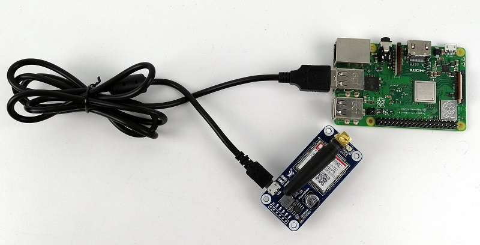

# Testing Raspberry Pi + SIM7000E NB-IoT Hat + Maxis NB-IoT 

## NB-IoT AT command testing
AT command test is basic step to check if NB-IoT is working in good condition.

### Prerequisite
- Raspberry Pi
- SIM7000E NB-IoT HAT
- MicroUSB Type B Cable

### Steps

1. Insert and lock the NB-IoT SIM card onto NB-IoT HAT (Back). Connect the NB-IoT HAT to Raspberry Pi Board via USB cable.


2. Run the command below on Raspberry Pi to check availability of HAT. It will show /dev/ttyUSB2 if it exists.
    
    ```
    ls /dev/ttyUSB2
    ```

3. Run the command below to install screen utility on Raspberry Pi, which allows us to communicate to HAT via UART.
    
    ```
    sudo apt-get install screen
    ```

4. Run below command to start.
    
    ```
    screen /dev/ttyUSB2 115200
    ```

5. Type and enter `AT` command repeatedly until you see `OK` in return.

6. Run AT commands below to test connection with Internet.

    ```c
    ->: User input

    # test using AT
    -> AT
    OK

    # check firmware version, make sure it contains SIM7000E
    -> AT+GSV
    SIMCOM_Ltd
    SIMCOM_SIM7000E
    Revision:1351B06SIM7000E

    # check service, result might be different
    -> AT+CPSI?
    +CPSI: GSM,Online,502-12,0x1054,62168,512 DCS 1800,-71,0,32-32
    -> AT+CPSI?
    +CPSI: NO SERVICE,Online

    # check signal quality
    -> AT+CSQ
    +CSQ: 23,99

    # configure to use NB-IoT
    -> AT+CMNB=2
    OK

    -> AT+CNMP=38
    OK

    -> AT+CBANDCFG="NB-IOT",8
    OK

    -> AT+CSTT="M2MXNBIOT"
    OK

    -> AT+CPSI?
    +CPSI: LTE NB-IOT,Online,502-12,0x74CE,28185722,12,EUTRAN-BAND8,3702,0,0,-10,-82,-72,15

    # check establish connection
    -> AT+CIPSTATUS
    OK

    STATE: IP START

    # start establish connection
    -> AT+CIICR
    OK

    -> AT+CIPSTATUS
    OK

    STATE: IP GPRSACT

    # get IP address
    -> AT+CIFSR
    10.247.96.227

    # ping www.google.com
    -> AT+CIPPING="www.google.com"
    +CIPPING: 1,"172.217.166.132",111,52
    +CIPPING: 2,"172.217.166.132",170,52
    +CIPPING: 3,"172.217.166.132",110,52
    +CIPPING: 4,"172.217.166.132",128,52
    ```

  7. Run `Ctrl-a` then `Ctrl-d` to minimise the screen. To Resume the screen run `screen -r`.

  8. Run `Ctrl-a` then type `:quit` to quit the screen.


## PPP Installation on Raspberry Pi
NB-IoT HAT offers PPP (Point-to-Point Protocol) for us to connect Raspberry Pi to Internet easily. The following steps show how to establish Internet connection with Raspberry Pi.

### Prerequisite
- Raspberry Pi
- SIM7000E NB-IoT HAT
- MicroUSB Type B Cable

### Steps

1. Plug the NB-IoT HAT into Raspberry Pi Board using USB. Ensure the Maxis SIM card is inserted and secured on the HAT.


2. Run the command below on Raspberry Pi to check availability of HAT. It will show /dev/ttyUSB2 if it exists.

    ```
    ls /dev/ttyUSB2
    ```

3. Go to directory where you have downloaded the GIT respository. E.g. /home/pi/maxis-nbiot-hackathon

    ```
    cd /home/pi/maxis-nbiot-hackathon
    ```

4. Run the commands below to install PPP on Raspberry Pi.
    
    ```
    $ cd "Raspberry Pi/PPP Installer"
    $ sudo chmod +x install.sh
    $ sudo ./install.sh
    ```

5. Run command below to start the connection. 

    ```
    sudo systemctl start nbiot.service
    ``` 

6. Run command below to check if interface ppp0 exists.
    
    ```
    ifconfig
    ``` 

7. If it is successful, you should see IP exists in interface ppp0 from `ifconfig` command.

8. Run command below to stop the connection. 

    ```
    sudo systemctl stop nbiot.service
    ``` 

9. To automate the connection during Raspberry Pi boot-up, run command `sudo systemctl enable nbiot.service`. To see the effect, run `sudo reboot` to restart Raspberry Pi.


### References
For more references, please visit https://www.rhydolabz.com/wiki/?p=16325
