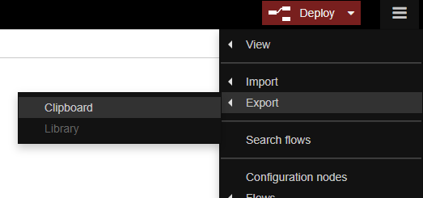
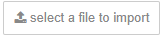

# IoT Web Application using Node Red

## Running Node Red on your Local Machine
1. Node Red requires NodeJS installation. Refer [here](https://nodejs.org/en/) to install latest NodeJS package.

2. In local terminal window, install Node Red.
    
    ```
    npm install node-red --unsafe-perm
    ```

3. Run command `node-red` to start Node Red.

4. If the output shows **Server now running at http://127.0.0.1:1880/**, navigate to 127.0.0.1:1880 in your web browser. You should be able to see Node Red webview.

5. Press `Ctrl+C` in terminal window to close Node Red.

6. (Optional) By default, the Node-RED editor is not secured - anyone who can access its IP address can access the editor and deploy changes. This is only suitable if you are running on a trusted network. See [this](https://nodered.org/docs/user-guide/runtime/securing-node-red) guide to secure your Node-RED application.

## Design your Node Red Application

In this application, we are going to learn to:

- Run an application which reads telemetry of the device using Azure Node Red Library.
- Create a web UI view to display telemetry of the device.
- Send an email when alert is triggered.

### Read Telemetry from Azure IoT Hub
1. Start Node Red, and browse to [http://127.0.0.1:1880](http://127.0.0.1:1880)

2. Install `node-red-contrib-azure-iot-hub` via **Manage Palette**. Manage Palette can be found under dropdown menu from menu button at top right corner of browser window.

3. From left pane of the browser window, scroll and search for **Azure IoT Hub Receiver** node under **Cloud** category, then drag it into the center of dashboard.
    
    

4. From the same left pane under **output** category, drag **debug** node to the dashboard. (It will be renamed as msg.payload once it is placed at dashboard)
    
    

5. Link it to **Azure IoT Hub Receiver** node.
    
    

6. Double-click on the Azure IoT Hub Receiver node and enter your Iot Hub connectionString for your Azure IoT Hub and click Done.
    
    

    


7. Click **Deploy**.

    

8. You should see the below messages on your command line from where you are running NodeRED. The Azure IoT Hub Receiver node should now say 'Connected'.
    
    

    


9. Once you have messages coming into your Azure IoT Hub, you should see them in the debug pane. The Azure IoT Hub Receiver node should now say 'Received'.
    
    
    
    

### Create a Web UI to display device telemetry

We are going to create 2 widgets which show temperature and humidity of the sensor.

1. Install `node-red-dashboard` using **Manage Palette**.
2. Go to Hamburger Menu -> Import -> Clipboard.

    

3. Paste the following code into the "Import nodes" dialog. Then click **Import**.

    ``` javascript
    [{"id":"4748d9e2.be7648","type":"tab","label":"Flow 1","disabled":false,"info":""},{"id":"706c73f9.d1df8c","type":"azureiothubreceiver","z":"4748d9e2.be7648","name":"Azure IoT Hub Receiver","x":140,"y":60,"wires":[["3ba06501.57624a","4a231742.945ba8","6851aa80.949924"]]},{"id":"3ba06501.57624a","type":"debug","z":"4748d9e2.be7648","name":"","active":true,"tosidebar":true,"console":false,"tostatus":false,"complete":"true","targetType":"full","x":380,"y":60,"wires":[]},{"id":"4a231742.945ba8","type":"ui_gauge","z":"4748d9e2.be7648","name":"Temperature","group":"d4a658b7.4c8a28","order":0,"width":"6","height":"6","gtype":"gage","title":"Temperature","label":"°C","format":"{{payload.temperature}}","min":0,"max":"100","colors":["#00b500","#e6e600","#ca3838"],"seg1":"","seg2":"","x":429,"y":147,"wires":[]},{"id":"6851aa80.949924","type":"ui_gauge","z":"4748d9e2.be7648","name":"Humidity","group":"d4a658b7.4c8a28","order":1,"width":"6","height":"6","gtype":"gage","title":"Humidity","label":"%","format":"{{payload.humidity}}","min":0,"max":"100","colors":["#00b500","#e6e600","#ca3838"],"seg1":"","seg2":"","x":358,"y":208,"wires":[]},{"id":"d4a658b7.4c8a28","type":"ui_group","z":"","name":"Current Reading","tab":"b8f8f747.dab748","order":1,"disp":true,"width":"12","collapse":false},{"id":"b8f8f747.dab748","type":"ui_tab","z":"","name":"Overview","icon":"dashboard","order":1,"disabled":false,"hidden":false}]
    ```
    

    

    !!! warning "Important !!"
        **Import flow including Azure IoT Hub Receiver node does not include connectionString by default. You will have to provide connectionString again.** Double-click on the Azure IoT Hub Receiver node and enter your Iot Hub connectionString for your Azure IoT Hub and click Done. 

5.  Click **Deploy**.

    

6. Browse to [http://127.0.0.1:1880/ui](http://127.0.0.1:1880/ui). You should be able to see the following screen.

    

To know more about how to create customized Node Red Dashboard, you can visit [https://randomnerdtutorials.com/getting-started-with-node-red-dashboard/](https://randomnerdtutorials.com/getting-started-with-node-red-dashboard/) as a starting point. There are also many websites online for you to Google!


### Send an email when alert is triggered

Here we will be using **[SendDrid](https://sendgrid.com)** service to send email for alert notification. You can use other option like **Gmail** service.

1. Install SendGrid node `node-red-contrib-sendgrid` using **Manage Palette** in Node-RED.
2. Create the flow by importing JSON below.

    ```
    [{"id":"4748d9e2.be7648","type":"tab","label":"Flow 1","disabled":false,"info":""},{"id":"706c73f9.d1df8c","type":"azureiothubreceiver","z":"4748d9e2.be7648","name":"Azure IoT Hub Receiver","x":140,"y":60,"wires":[["77746ec7.63db9","3ba06501.57624a"]]},{"id":"3ba06501.57624a","type":"debug","z":"4748d9e2.be7648","name":"","active":true,"tosidebar":true,"console":false,"tostatus":false,"complete":"true","targetType":"full","x":380,"y":60,"wires":[]},{"id":"4f0d6c8e.4291e4","type":"sendgrid","z":"4748d9e2.be7648","from":"no-reply@example.com","to":"popfibo@gmail.com","name":"Send email","content":"text","x":962,"y":288,"wires":[]},{"id":"77746ec7.63db9","type":"switch","z":"4748d9e2.be7648","name":"Condition to send email","property":"payload.temperature","propertyType":"msg","rules":[{"t":"gte","v":"30","vt":"str"}],"checkall":"true","repair":false,"outputs":1,"x":190,"y":291,"wires":[["167c7aa.94e2385"]]},{"id":"27bb65ef.759cba","type":"template","z":"4748d9e2.be7648","name":"Email template","field":"payload","fieldType":"msg","format":"handlebars","syntax":"mustache","template":"Alert! The temperature from {{ deviceId }} has exceeded 30°C! Current temperature is {{ payload.temperature }}.","output":"str","x":614,"y":290,"wires":[["38930ee.12709f2"]]},{"id":"167c7aa.94e2385","type":"delay","z":"4748d9e2.be7648","name":"Limit 1 email per 5min","pauseType":"rate","timeout":"5","timeoutUnits":"seconds","rate":"1","nbRateUnits":"5","rateUnits":"minute","randomFirst":"1","randomLast":"5","randomUnits":"seconds","drop":true,"x":416,"y":291,"wires":[["27bb65ef.759cba"]]},{"id":"38930ee.12709f2","type":"change","z":"4748d9e2.be7648","name":"Email Settings","rules":[{"t":"set","p":"payload","pt":"msg","to":"payload","tot":"msg"},{"t":"set","p":"topic","pt":"msg","to":"Temperature Alert","tot":"str"}],"action":"","property":"","from":"","to":"","reg":false,"x":792,"y":289,"wires":[["4f0d6c8e.4291e4"]]}]
    ```

    You will see the screen as below.
    


3. Get API key from [SendGrid website](https://sendgrid.com/).
4. Double click on **Send email** node (which is a sendgrid node), fill in necessary info and paste the API key.
5. Click **Deploy**.

    

#### Explanation:
- Condition to send email is handled by `Condition to send email` node. When the temperature exceeds 30°C, the email will be sent.
- Email has a cooldown period of 5 minutes, during this time the email will not be sent although the temperature exceeds 30°C. This is handled by `Limit 1 email per 5 min` node.
- `Email template` node allows you to decide what content to be sent in email.
- `Email settings` node allows you to add extra parameters like topic, cc, bcc.

### Final result

- Backend Application

    

- UI Dashboard

    

- Full working JSON

    ```
    [{"id":"bc488bc5.7b36c8","type":"tab","label":"Flow 1","disabled":false,"info":""},{"id":"72280523.04ccec","type":"ui_group","z":"","name":"Current Reading","tab":"619a0ac8.53b8a4","order":1,"disp":true,"width":"12","collapse":false},{"id":"619a0ac8.53b8a4","type":"ui_tab","z":"","name":"Overview","icon":"dashboard","order":1},{"id":"74561fa2.60827","type":"ui_base","theme":{"name":"theme-light","lightTheme":{"default":"#0094CE","baseColor":"#0094CE","baseFont":"-apple-system,BlinkMacSystemFont,Segoe UI,Roboto,Oxygen-Sans,Ubuntu,Cantarell,Helvetica Neue,sans-serif","edited":true,"reset":false},"darkTheme":{"default":"#097479","baseColor":"#097479","baseFont":"-apple-system,BlinkMacSystemFont,Segoe UI,Roboto,Oxygen-Sans,Ubuntu,Cantarell,Helvetica Neue,sans-serif","edited":false},"customTheme":{"name":"Untitled Theme 1","default":"#4B7930","baseColor":"#4B7930","baseFont":"-apple-system,BlinkMacSystemFont,Segoe UI,Roboto,Oxygen-Sans,Ubuntu,Cantarell,Helvetica Neue,sans-serif"},"themeState":{"base-color":{"default":"#0094CE","value":"#0094CE","edited":false},"page-titlebar-backgroundColor":{"value":"#0094CE","edited":false},"page-backgroundColor":{"value":"#fafafa","edited":false},"page-sidebar-backgroundColor":{"value":"#ffffff","edited":false},"group-textColor":{"value":"#1bbfff","edited":false},"group-borderColor":{"value":"#ffffff","edited":false},"group-backgroundColor":{"value":"#ffffff","edited":false},"widget-textColor":{"value":"#111111","edited":false},"widget-backgroundColor":{"value":"#0094ce","edited":false},"widget-borderColor":{"value":"#ffffff","edited":false},"base-font":{"value":"-apple-system,BlinkMacSystemFont,Segoe UI,Roboto,Oxygen-Sans,Ubuntu,Cantarell,Helvetica Neue,sans-serif"}},"angularTheme":{"primary":"indigo","accents":"blue","warn":"red","background":"grey"}},"site":{"name":"Node-RED Dashboard","hideToolbar":"false","allowSwipe":"false","dateFormat":"DD/MM/YYYY","sizes":{"sx":48,"sy":48,"gx":6,"gy":6,"cx":6,"cy":6,"px":0,"py":0}}},{"id":"78f670e6.6d9bc","type":"ui_group","z":"","name":"Current Reading","tab":"78eac48a.20fd8c","order":1,"disp":true,"width":"12","collapse":false},{"id":"78eac48a.20fd8c","type":"ui_tab","z":"","name":"Overview","icon":"dashboard","order":1,"disabled":false,"hidden":false},{"id":"b828193e.d6c448","type":"ui_group","z":"","name":"Current Reading","tab":"91d14d66.2b94","order":1,"disp":true,"width":"12","collapse":false},{"id":"91d14d66.2b94","type":"ui_tab","z":"","name":"Overview","icon":"dashboard","order":1,"disabled":false,"hidden":false},{"id":"8ea2cd4f.2878c","type":"azureiothubreceiver","z":"bc488bc5.7b36c8","name":"Azure IoT Hub Receiver","x":140,"y":60,"wires":[["8f36c520.fb5e58","40b6b683.04c548","89f0aa8d.578d48","96844771.27e478"]]},{"id":"8f36c520.fb5e58","type":"debug","z":"bc488bc5.7b36c8","name":"","active":true,"tosidebar":true,"console":false,"tostatus":false,"complete":"true","targetType":"full","x":380,"y":60,"wires":[]},{"id":"40b6b683.04c548","type":"ui_gauge","z":"bc488bc5.7b36c8","name":"Temperature","group":"b828193e.d6c448","order":0,"width":"6","height":"6","gtype":"gage","title":"Temperature","label":"°C","format":"{{payload.temperature}}","min":0,"max":"100","colors":["#00b500","#e6e600","#ca3838"],"seg1":"","seg2":"","x":429,"y":147,"wires":[]},{"id":"89f0aa8d.578d48","type":"ui_gauge","z":"bc488bc5.7b36c8","name":"Humidity","group":"b828193e.d6c448","order":1,"width":"6","height":"6","gtype":"gage","title":"Humidity","label":"%","format":"{{payload.humidity}}","min":0,"max":"100","colors":["#00b500","#e6e600","#ca3838"],"seg1":"","seg2":"","x":358,"y":208,"wires":[]},{"id":"a72bcedd.3440d","type":"sendgrid","z":"bc488bc5.7b36c8","from":"","to":"","name":"Send email","content":"text","x":1056,"y":292,"wires":[]},{"id":"96844771.27e478","type":"switch","z":"bc488bc5.7b36c8","name":"Condition to send email","property":"payload.temperature","propertyType":"msg","rules":[{"t":"gte","v":"30","vt":"str"}],"checkall":"true","repair":false,"outputs":1,"x":260,"y":293,"wires":[["50792deb.086f44"]]},{"id":"33d14c05.c9e964","type":"template","z":"bc488bc5.7b36c8","name":"Email template","field":"payload","fieldType":"msg","format":"handlebars","syntax":"mustache","template":"Alert! The temperature from {{ deviceId }} has exceeded 30°C! Current temperature is {{ payload.temperature }}°C.","output":"str","x":703,"y":293,"wires":[["c97cd755.df9218"]]},{"id":"50792deb.086f44","type":"delay","z":"bc488bc5.7b36c8","name":"Limit 1 email per 5min","pauseType":"rate","timeout":"5","timeoutUnits":"seconds","rate":"1","nbRateUnits":"5","rateUnits":"minute","randomFirst":"1","randomLast":"5","randomUnits":"seconds","drop":true,"x":492,"y":293,"wires":[["33d14c05.c9e964"]]},{"id":"c97cd755.df9218","type":"change","z":"bc488bc5.7b36c8","name":"Email Settings","rules":[{"t":"set","p":"payload","pt":"msg","to":"payload","tot":"msg"},{"t":"set","p":"topic","pt":"msg","to":"Temperature Alert","tot":"str"}],"action":"","property":"","from":"","to":"","reg":false,"x":884,"y":292,"wires":[["a72bcedd.3440d"]]}]
    ```


### Challenges
You can implement other features in this application.

1. Store telemetry of the device to database.
2. Create a web UI which shows the analytics.
3. .. and many more.

You can look into [https://github.com/Azure/node-red-contrib-azure](https://github.com/Azure/node-red-contrib-azure) for more libraries and modules for Azure. It is up to your creativity. The other libraries you may find useful for your application:

- [Azure Blob Storage](https://github.com/Azure/node-red-contrib-azure/tree/master/blob-storage)

- [Azure CosmosDB (formerly DocumentDB)]("https://github.com/Azure/node-red-contrib-azure/tree/master/documentdb)

- [Azure Event Hub](https://github.com/Azure/node-red-contrib-azure/tree/master/event-hub)

- [Azure SQL](https://github.com/Azure/node-red-contrib-azure/tree/master/sql)

- [Azure Table Storage](https://github.com/Azure/node-red-contrib-azure/tree/master/table-storage)

### Save your work!!!

One thing Node Red is good is that you can export your work to a JSON file. So if next time you are building a new machine and set up fresh Node Red, you can import the same file, do some configuration on nodes and you are ready to go!

- Export your application
    

- Download as JSON file
    

## Deploy on Microsoft Azure

Once we have done developing the application, it is time for us to deploy it to the cloud so we can view it anywhere as long as we have Internet.

### Create base image

1. Log in to the [Azure console](https://portal.azure.com/)

2. Select **Virtual Machines** option under Favourite List.

3. In the list of Virtual Machines, select Ubuntu Server, then click ‘Create’

4. Give your machine a name, the username you want to use and the authentication details you want to use to access the instance

4. Choose the Size of your instance. Remember that node.js is single-threaded so there’s no benefit to picking a size with multiple cores for a simple node-red instance. A1 Basic is a good starting point

5. On the ‘Settings’ step, click on the ‘Network security group’ option. Add a new ‘Inbound rule’ with the options set as:
    ```c
    - Name: node-red-editor
    - Priority: 1010
    - Protocol: TCP
    - Destination port range: 1880
    ```
6. Click ‘Ok’ on the Settings page, check the Summary then click ‘Ok’ to deploy the new instance

After a couple of minutes your instance will be running. In the console you can find your instance’s IP address.

### Setup Node Red

1. The next task is to log into the instance then install node.js and Node-RED.

2. Log into your instance using the authentication details you specified in the previous stage.

3. Once logged in you need to install node.js and Node-RED.

    ```
    $ curl -sL https://deb.nodesource.com/setup_10.x | sudo -E bash -
    $ sudo apt-get install -y nodejs build-essential
    $ sudo npm install -g node-red
    ```

4. At this point you can test your instance by running command below.
    
    ```
    node-red
    ```

    !!! info "Note"
        You may get some errors regarding the Serial node - that’s to be expected and can be ignored.

5. Once started, you can access the editor at `http://<your-instance-ip>:1880/`.

6. To get Node-RED to start automatically whenever your instance is restarted, you can use pm2:

    ```
    sudo npm install -g pm2
    pm2 start `which node-red` -- -v
    pm2 save
    pm2 startup
    ```

### Import your Application

If you have your application exported to JSON file from this [step](#save-your-work), deployment will be super easy!

1. Go to Hamburger Menu -> Import -> Clipboard.

2. Select `select a file to import`. Choose your desired JSON file to be import.

    

3. Click **Import** to finish your import.
4. Make sure your configuration is complete (e.g. Fill in Azure IoT Hub ConnectionString, SendGrid info etc.)
5. Click **Deploy**.

    

    
### References
For more information, please visit [https://nodered.org/docs/getting-started/azure](https://nodered.org/docs/getting-started/azure)
